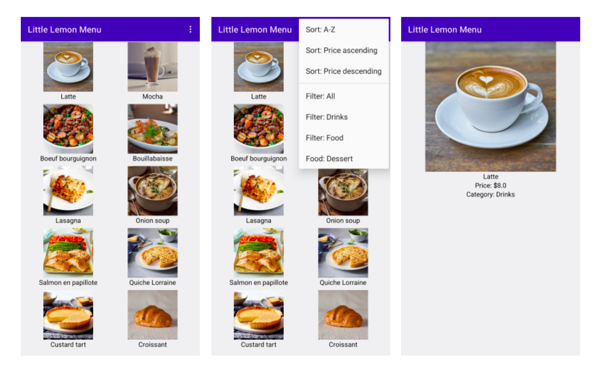

## kotlin-advance
### Exercise: Final project - Little Lemon dinner menu

#### The project outline
The Little Lemon restaurant has built a menu application for its customers. It has a list of all the products provided by their main branch. Currently, customers can only browse the list, but can’t sort, search or filter it. Therefore, there’s considerable room to improve the user experience.

